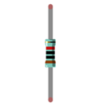
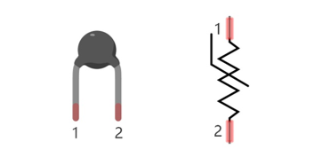
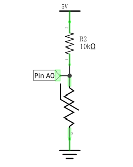
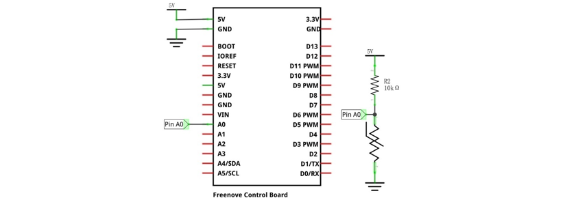
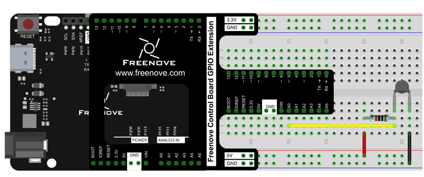
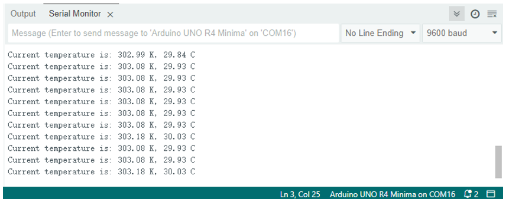

##############################################################################
Chapter Temperature Sensor
##############################################################################

Earlier, we have used control board and photoresistor to detect the intensity of light. Now, we will learn to use the temperature sensor.

Project Detect the Temperature
*********************************************

We will use a thermistor to detect the ambient temperature.

Component List
================================

+------------------------------------------------------+
| Control board x1                                     |
|                                                      |
| |Chapter01_00|                                       |
+--------------------------+---------------------------+
| Breadboard x1            | GPIO Extension Board x1   |
|                          |                           |
| |Chapter02_00|           | |Chapter02_01|            |
+------------------+-------+---------------------------+
| USB cable x1     | Jumper M/M x3                     |
|                  |                                   |
| |Chapter01_02|   | |Chapter01_03|                    |
+------------------+------+----------------------------+
| Thermistor x1           | Thermistor x1              |
|                         |                            |
| |Chapter15_00|          |  |Chapter15_01|            |
+-------------------------+----------------------------+

.. |Chapter01_00| image:: ../_static/imgs/1_LED_Blink/Chapter01_00.png
.. |Chapter01_02| image:: ../_static/imgs/1_LED_Blink/Chapter01_02.png
.. |Chapter01_03| image:: ../_static/imgs/1_LED_Blink/Chapter01_03.png
.. |Chapter02_00| image:: ../_static/imgs/2_Two_LEDs_Blink/Chapter02_00.png
.. |Chapter02_01| image:: ../_static/imgs/2_Two_LEDs_Blink/Chapter02_01.png

Component Knowledge
=================================

Thermistor
---------------------------

Thermistor is a temperature sensitive resistor. When it senses a change in temperature, the resistance of the Thermistor will change. We can take advantage of this characteristic by using a Thermistor to detect temperature intensity. A Thermistor and its electronic symbol are shown below.

The relationship between resistance value and temperature of thermistor is:

    Rt=R*EXP[B*(1/T2-1/T1)]

Where:

    Rt is the thermistor resistance under T2 temperature;

    R is in the nominal resistance of thermistor under T1 temperature;

    EXP[n] is nth power of e;

    B is for thermal index;

    T1, T2 is Kelvin temperature (absolute temperature). Kelvin temperature=273.15+celsius temperature.

Parameters of the thermistor we use is: B=3950, R=10k, T1=25.

The circuit connection method of the thermistor is similar to photoresistor, as the following:

We can use the value measured by the analog pin of control board to obtain resistance value of the thermistor, and then we can use the formula to obtain the temperature value.

Circuit
=========================

Use pin A0 on the control board to detect the voltage of thermistor.

.. list-table:: 
   :width: 100%
   :align: center

   * -  Schematic diagram
   * -  |Chapter15_04|
   * -  Hardware connection 
     
        If you need any support, please feel free to contact us via: support@freenove.com

   * -  |Chapter15_05|

Sketch
===============================

Sketch Detect_the_temperature
-------------------------------

Now, write the code to detect the voltage value of thermistor, calculate the temperature value, and send it to Serial Monitor.

.. literalinclude:: ../../../freenove_Kit/Sketches/Sketch_15.1.1_Detect_the_temperature/Sketch_15.1.1_Detect_the_temperature.ino
    :linenos: 
    :language: c
    :lines: 1-32
    :dedent:

In the code, we obtain the ADC value of pin A0, and convert it into temperature value, and then send it to the serial port.

Verify and upload the code, open the Serial Monitor, and then you will see the temperature value sent from control board.

