##############################################################################
Chapter LED Matrix
##############################################################################

In the previous chapter, we have learned how to use some modules and sensors and shows some information on the computer through serial port. Now let us learn some modules which can output images and text.

In this chapter, we will learn how to use the LED matrix to output characters and images.

Project 74HC595
**********************************

Firstly, let us learn how to use the 74HC595 chip, which is very helpful for us to control the LED matrix.

Component List
================================

+------------------------------------------------------+
| Control board x1                                     |
|                                                      |
| |Chapter01_00|                                       |
+--------------------------+---------------------------+
| Breadboard x1            | GPIO Extension Board x1   |
|                          |                           |
| |Chapter02_00|           | |Chapter02_01|            |
+------------------+-------+---------------------------+
| USB cable x1     | Jumper M/M x15                    |
|                  |                                   |
| |Chapter01_02|   | |Chapter01_03|                    |
+----------------+-+--------------+--------------------+
| 74HC595 x1     |LED bar graph x1| Resistor 220Ω x8   |
|                |                |                    |
| |Chapter18_00| | |Chapter18_01| |   |Chapter18_02|   |
+----------------+----------------+--------------------+

.. |Chapter01_00| image:: ../_static/imgs/1_LED_Blink/Chapter01_00.png
.. |Chapter01_02| image:: ../_static/imgs/1_LED_Blink/Chapter01_02.png
.. |Chapter01_03| image:: ../_static/imgs/1_LED_Blink/Chapter01_03.png
.. |Chapter02_00| image:: ../_static/imgs/2_Two_LEDs_Blink/Chapter02_00.png
.. |Chapter02_01| image:: ../_static/imgs/2_Two_LEDs_Blink/Chapter02_01.png
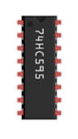
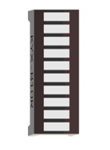
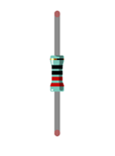

Code Knowledge
==============================

Hexadecimal
-------------------------

The conversion between binary and decimal system has been mentioned before. When you write the code, the number is decimal by default. Hexadecimal numbers need to add the 0x prefix in the code, such as 0x01.

One Hexadecimal bit can present one number between 0-15. In order to facilitate writing, the numbers greater than 9 are written into the letter A-F (case-insensitive) such as 0x2A. The corresponding relationship is as follows:

+-----------+-----+-----+-----+-----+-----+-----+-----+-----+-----+-----+-----+-----+-----+-----+-----+-----+
| Number    | 0   | 1   | 2   | 3   | 4   | 5   | 6   | 7   | 8   | 9   | 10  | 11  | 12  | 13  | 14  | 15  |
+-----------+-----+-----+-----+-----+-----+-----+-----+-----+-----+-----+-----+-----+-----+-----+-----+-----+
| Represent | 0   | 1   | 2   | 3   | 4   | 5   | 6   | 7   | 8   | 9   | A   | B   | C   | D   | E   | F   |
+-----------+-----+-----+-----+-----+-----+-----+-----+-----+-----+-----+-----+-----+-----+-----+-----+-----+

Conversion between hexadecimal and decimal system is similar to the conversion between hexadecimal and binary such as the sixteen digit 0x12:

+----------+-----+-----+
| Sequence | 1   | 0   |
+----------+-----+-----+
| Number   | 1   | 2   |
+----------+-----+-----+

Conversion between hexadecimal and decimal system is similar to the conversion between hexadecimal and binary such as the sixteen digit 0x12:

+----------+-----+-----+
| Sequence | 1   | 0   |
+----------+-----+-----+
| Number   | 1   | 2   |
+----------+-----+-----+

When a hexadecimal number need to be converted to decimal number, first, the nth number of it need be multiplied by n power of 16, then sum all multiplicative results. Take 0x12 as an example:

1*16^1+2*16^0=18

When decimal number is converted to hexadecimal number, decimal number is divided by 16. Then we will get quotient and remainder, and quotient obtained will be continuously divided by 16 until quotient is zero. Arrange all remainders from right to left in a line. Then we complete the conversion. For example:

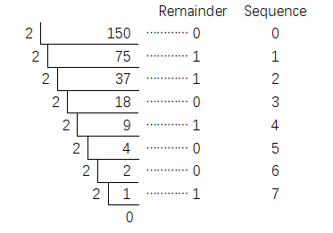

The result is of the conversion 0x12.

When you write code, sometimes it is convenient to use hexadecimal, especially involving bit operation, because 1 hexadecimal number can be expressed by 4 binary number (2^4=16). The corresponding relationship between 4 bit binary numbers and 1 hexadecimal number is shown as follows:

+-------------------------+------+------+------+------+------+------+------+------+
| 4 bit binary            | 0000 | 0001 | 0010 | 0011 | 0100 | 0101 | 0110 | 0111 |
+-------------------------+------+------+------+------+------+------+------+------+
| 1 figure of hexadecimal | 0    | 1    | 2    | 3    | 4    | 5    | 6    | 7    |
+-------------------------+------+------+------+------+------+------+------+------+

+-------------------------+------+------+------+------+------+------+------+------+
| 4  bit binary           | 1000 | 1001 | 1010 | 1011 | 1100 | 1101 | 1110 | 1111 |
+-------------------------+------+------+------+------+------+------+------+------+
| 1 figure of hexadecimal | 8    | 9    | A    | B    | C    | D    | E    | F    |
+-------------------------+------+------+------+------+------+------+------+------+

For example, binary 00010010 is corresponding to hexadecimal 0x12.

Component Knowledge
===================================

74HC595
-----------------------------

A 74HC595 chip is used to convert serial data into parallel data. A 74HC595 chip can convert the serial data of one byte into 8 bits, and send its corresponding level to each of the 8 ports correspondingly. With this characteristic, the 74HC595 chip can be used to expand the IO ports the control board. At least 3 ports on the RPI board are required to control the 8 ports of the 74HC595 chip.

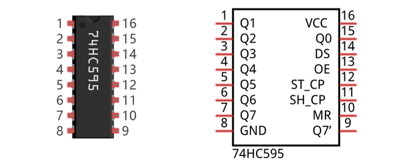

The ports of 74HC595 are described as follows:

+----------+------------+-------------------------------------------------------------------------------------------------------+
| Pin name | Pin number | Description                                                                                           |
+----------+------------+-------------------------------------------------------------------------------------------------------+
| Q0-Q7    | 15, 1-7    | Parallel data output                                                                                  |
+----------+------------+-------------------------------------------------------------------------------------------------------+
| VCC      | 16         | The positive electrode of power supply, the voltage is 2~6V                                           |
+----------+------------+-------------------------------------------------------------------------------------------------------+
| GND      | 8          | The negative electrode of power supply                                                                |
+----------+------------+-------------------------------------------------------------------------------------------------------+
| DS       | 14         | Serial data Input                                                                                     |
+----------+------------+-------------------------------------------------------------------------------------------------------+
|          |            | Enable output,                                                                                        |
|          |            |                                                                                                       |
| OE       | 13         | When this pin is in high level, Q0-Q7 is in high resistance state                                     |
|          |            |                                                                                                       |
|          |            | When this pin is in low level, Q0-Q7 is in output mode                                                |
+----------+------------+-------------------------------------------------------------------------------------------------------+
| ST_CP    | 12         | Parallel update output: when its electrical level is rising, it will update the parallel data output. |
+----------+------------+-------------------------------------------------------------------------------------------------------+
| SH_CP    | 11         | Serial shift clock: when its electrical level is rising, serial data input register will do a shift.  |
+----------+------------+-------------------------------------------------------------------------------------------------------+
| MR       | 10         | Remove shift register: When this pin is in low level, the content in shift register will be cleared . |
+----------+------------+-------------------------------------------------------------------------------------------------------+
| Q7'      | 9          | Serial data output: it can be connected to more 74HC595 in series.                                    |
+----------+------------+-------------------------------------------------------------------------------------------------------+

For more detail, please refer to the datasheet.

Circuit
==========================

Use pin 11, 12, 13 on the control board to control the 74HC595, and connect it to the 8 LEDs of LED bar graph.

.. list-table:: 
   :width: 100%
   :align: center

   * -  Schematic diagram
   * -  |Chapter18_05|
   * -  Hardware connection 
     
        If you need any support, please feel free to contact us via: support@freenove.com

   * -  |Chapter18_06|

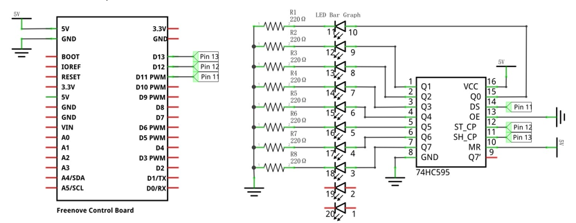
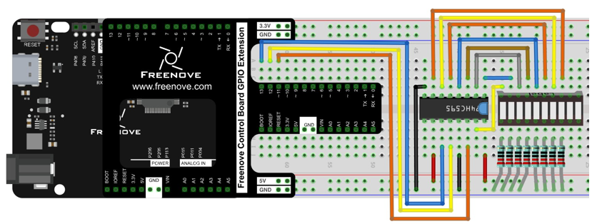

Sketch
========================

Sketch 74HC595
------------------------

Now write code to control the 8 LEDs of LED bar graph through 74HC595.

.. literalinclude:: ../../../freenove_Kit/Sketches/Sketch_18.1.1_74HC595/Sketch_18.1.1_74HC595.ino
    :linenos: 
    :language: c
    :lines: 1-34
    :dedent:

In the code, we configure three pins to control the 74HC595. And define a one-byte variable to control the state of 8 LEDs through the 8 bits of the variable. The LED lights on when the corresponding bit is 1. If the variable is assigned to 0x01, that is 00000001 in binary, there will be only one LED on. 

.. literalinclude:: ../../../freenove_Kit/Sketches/Sketch_18.1.1_74HC595/Sketch_18.1.1_74HC595.ino
    :linenos: 
    :language: c
    :lines: 22-22
    :dedent:

In each loop, the x is sent to 74HC595. The sending process is as follows:

.. literalinclude:: ../../../freenove_Kit/Sketches/Sketch_18.1.1_74HC595/Sketch_18.1.1_74HC595.ino
    :linenos: 
    :language: c
    :lines: 24-29
    :dedent:

The x will be shift 1 bit to left in each cycle, which makes the bright LED of the 8 LEDs move one bit.

.. literalinclude:: ../../../freenove_Kit/Sketches/Sketch_18.1.1_74HC595/Sketch_18.1.1_74HC595.ino
    :linenos: 
    :language: c
    :lines: 31-31
    :dedent:

.. py:function:: << operator	
    
    "<<" is the left shift operator, which can make all bits of 1 byte shift by several bits to the left (high) direction and add 0 on the right (low). For example, shift binary 00000001 by 1 bit to left:
    
    byte x = 1 << 1;
    
    .. image:: ../_static/imgs/18_LED_Matrix/Chapter18_07.png
        :align: center

    The result of x is 2(binary 00000010).

    .. image:: ../_static/imgs/18_LED_Matrix/Chapter18_08.png
        :align: center

    There is another similar operator" >>". For example, shift binary 00000001 by 1 bit to right:
    
    byte x = 1 >> 1;

    .. image:: ../_static/imgs/18_LED_Matrix/Chapter18_09.png
        :align: center

    The result of x is 0(00000000).

    .. image:: ../_static/imgs/18_LED_Matrix/Chapter18_10.png
        :align: center

    X <<= 1 is equivalent to x = x << 1 and x >>= 1 is equivalent to x = x >> 1

Verify and upload the code, and then you will see the LED bar graph with the effect of flowing water.

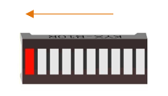

Project LED Matrix
****************************************

In the previous section, we have used 74HC595 to control 8 LEDs of the LED bar graph. Now let's use 74HC595 to control LED matrix.

Component List
===============================

+------------------------------------------------------+
| Control board x1                                     |
|                                                      |
| |Chapter01_00|                                       |
+--------------------------+---------------------------+
| Breadboard x1            | GPIO Extension Board x1   |
|                          |                           |
| |Chapter02_00|           | |Chapter02_01|            |
+------------------+-------+---------------------------+
| USB cable x1     | Jumper M/M x15                    |
|                  |                                   |
| |Chapter01_02|   | |Chapter01_03|                    |
+----------------+-+--------------+--------------------+
| 74HC595 x1     | LED matrix x1  | Resistor 220Ω x8   |
|                |                |                    |
| |Chapter18_00| | |Chapter18_12| |   |Chapter18_02|   |
+----------------+----------------+--------------------+

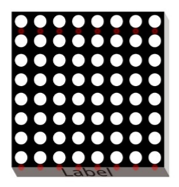

Component Knowledge
===============================

LED matrix
-----------------------------

An LED Matrix is a rectangular display module that consists of a uniform grid of LEDs. The following is an 8X8 monochrome (one color) LED Matrix containing 64 LEDs (8 rows by 8 columns).

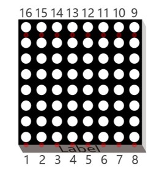

In order to facilitate the operation and reduce the number of ports required to drive this component, the Positive Poles of the LEDs in each row and Negative Poles of the LEDs in each column are respectively connected together inside the LED Matrix module, which is called a Common Anode. There is another arrangement type. Negative Poles of the LEDs in each row and the Positive Poles of the LEDs in each column are respectively connected together, which is called a Common Cathode.

The LED Matrix that we use in this project is a Common Anode LED Matrix.

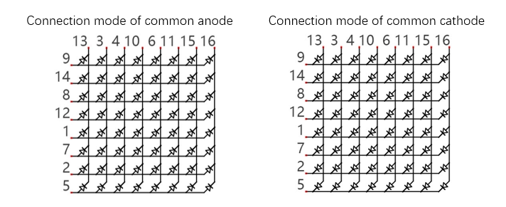

Here is how a Common Anode LED Matrix works. First, choose 16 ports on RPI board to connect to the 16 ports of LED Matrix. Configure one port in columns for low level, which makes that column the selected port. Then configure the eight port in the row to display content in the selected column. Add a delay value and then select the next column that outputs the corresponding content. This kind of operation by column is called Scan. If you want to display the following image of a smiling face, you can display it in 8 columns, and each column is represented by one byte.

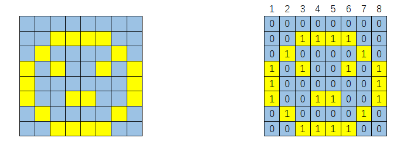

+--------+-----------+-------------+
| Column | Binary    | Hexadecimal |
+--------+-----------+-------------+
| 1      | 0001 1100 | 0x1c        |
+--------+-----------+-------------+
| 2      | 0010 0010 | 0x22        |
+--------+-----------+-------------+
| 3      | 0101 0001 | 0x51        |
+--------+-----------+-------------+
| 4      | 0100 0101 | 0x45        |
+--------+-----------+-------------+
| 5      | 0100 0101 | 0x45        |
+--------+-----------+-------------+
| 6      | 0101 0001 | 0x51        |
+--------+-----------+-------------+
| 7      | 0010 0010 | 0x22        |
+--------+-----------+-------------+
| 8      | 0001 1100 | 0x1c        |
+--------+-----------+-------------+

Scanning rows is another option to display on an LED Matrix (dot matrix grid). Whether scanning by row or column, 16 GPIO is required. In order to save GPIO ports of control board, two 74HC595 IC Chips are used in the circuit. 

Circuit
=======================

Use pin 11, 12, 13 on control board to control the 74HC595. And connect 74HC595 to the 8 anode pins of LED Matrix, in the meanwhile, connect 8 digitals port on control board to the 8 cathode pins of LED Matrix.

.. list-table:: 
   :width: 100%
   :align: center

   * -  Schematic diagram
   * -  |Chapter18_16|
   * -  Hardware connection 
     
        If you need any support, please feel free to contact us via: support@freenove.com

   * -  |Chapter18_17|

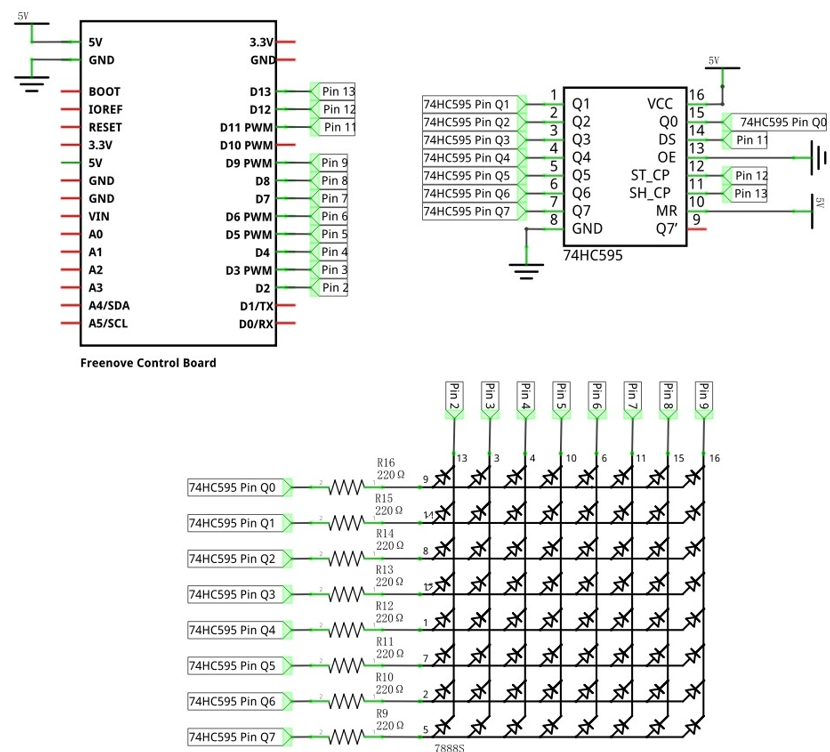
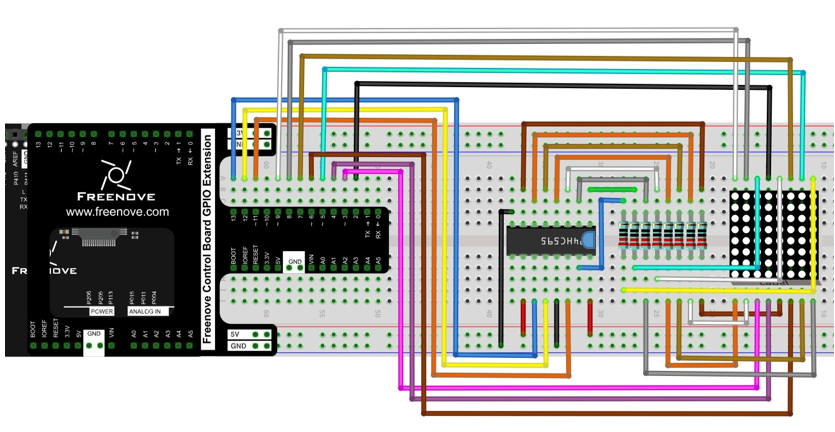

Sketch
====================

Sketch LED_Matrix
----------------------

Now write the code to drive LED dot matrix to display static and dynamic images, in fact, the dynamic image is formed by continuous static image.

.. literalinclude:: ../../../freenove_Kit/Sketches/Sketch_18.2.1_LED_Matrix/Sketch_18.2.1_LED_Matrix.ino
    :linenos: 
    :language: c
    :lines: 1-93
    :dedent:

In the code, use an array to define the column pins of LED Matrix.

.. literalinclude:: ../../../freenove_Kit/Sketches/Sketch_18.2.1_LED_Matrix/Sketch_18.2.1_LED_Matrix.ino
    :linenos: 
    :language: c
    :lines: 14-16
    :dedent:

Use another array to define some numbers and letters, and every eight elements of the array represent a dot matrix pattern data of a number or a letter.

.. literalinclude:: ../../../freenove_Kit/Sketches/Sketch_18.2.1_LED_Matrix/Sketch_18.2.1_LED_Matrix.ino
    :linenos: 
    :language: c
    :lines: 18-36
    :dedent:

.. py:function:: PROGMEM keyword

    Microprocessors generally have two storage areas, namely ROM and RAM. ROM is used to store code. And these stored data will not change with the execution of code until the code are uploaded. RAM is used to store data, for example, the variables we defined are stored here. The stored data will change in real time with the execution of the code. Generally, capacity of RAM is small. So we can use PROGMEM keyword to save the data that don't change in ROM.

Define two functions, one of them uses control board port to select the column.

.. literalinclude:: ../../../freenove_Kit/Sketches/Sketch_18.2.1_LED_Matrix/Sketch_18.2.1_LED_Matrix.ino
    :linenos: 
    :language: c
    :lines: 77-84
    :dedent:

Another one uses 74HC595 to write data of the row.

.. literalinclude:: ../../../freenove_Kit/Sketches/Sketch_18.2.1_LED_Matrix/Sketch_18.2.1_LED_Matrix.ino
    :linenos: 
    :language: c
    :lines: 86-93
    :dedent:

.. py:function:: ? :  operator
    
    "? :" operator is similar to conditional statements. When the expression in front of "?" is tenable, the statement in front of ":" will be executed. When the expression is not tenable, the statement behind ":" will be executed. For example:
    
    int a = (1 > 0) ? 2: 3;
    
    Because 1>0 is tenable, so "a" will be assigned to 2.

.. py:function:: Bitwise logical operation
    
    There are many bitwise logical operators such as and (&), or (|), xor (^), negate (~). The result of exclusive or (^) is true only when two corresponding bit is not equal. 
    
    &, | and ^ is used to operate the corresponding bit of two numbers. Such as:
    
    byte a = 1 & 2;
    
    "a" will be assigned to 0. The calculation procedure is as follows:
    
      1(00000001)
    
    & 2(00000010)
    
      0(00000000)
    
    Negate (~) is used to negate a number, for example:
    
    byte a = ~15;
    
    "a" will be assigned to 240. The calculation procedure is as follows:
    
    ~ 15(00001111)
        
    240(11110000)

In the loop () function, firstly, show the static smile pattern. Select one of the 8 columns circularly in turn to display each the result. Repeat 500 times the process, then we can see a static smile pattern.

.. literalinclude:: ../../../freenove_Kit/Sketches/Sketch_18.2.1_LED_Matrix/Sketch_18.2.1_LED_Matrix.ino
    :linenos: 
    :language: c
    :lines: 52-61
    :dedent:

Then display the dynamic pattern of the numbers and letters. We have defined space, 0-9, A-F, total of 16 characters (136 columns) in an array, among which 8 adjacent rows of data form one frame. Shift one column once. There are for 128 frames of image from the first frame (1-8) to the last frame (128-136 column). Each frame image is displayed 10 times, then display the next frame. Repeat the process above, then we can see the pattern of scrolling numbers and letters.

.. literalinclude:: ../../../freenove_Kit/Sketches/Sketch_18.2.1_LED_Matrix/Sketch_18.2.1_LED_Matrix.ino
    :linenos: 
    :language: c
    :lines: 63-74
    :dedent:

Verify and upload the code, then LED Matrix begins to display the static smile pattern. A few seconds later, LED Matrix will display the scrolling number 0-9 and the letter A-F.