##############################################################################
Chapter I2C LCD1602
##############################################################################

In the previous chapter, we have used the LED matrix to display images and characters. Now, let us use a screen module LCD1602 with a higher resolution to display more content.

There are multiple versions of LCD1602. Your purchase may be one of the following:

.. list-table:: 
   :width: 100%
   :align: center

   * -  I2C LCD1602
     -  I2C LCD1602
   * -  |Chapter20_00|
     -  |Chapter20_01|

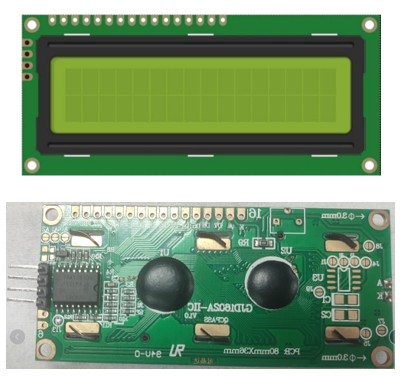
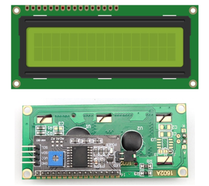

There is a conversion module on the back of the I2C LCD1602 module. Convert parallel interface to I2C serial interface. Although they have different interfaces, their functions are the same.

Project Display the String on I2C LCD1602
*******************************************************

In this chapter, we will learn about the LCD1602 Display Screen.Firstly, use I2C LCD1602 to display some strings.

Component List
================================

+------------------------------------------------------+
| Control board x1                                     |
|                                                      |
| |Chapter01_00|                                       |
+--------------------------+---------------------------+
| Breadboard x1            | GPIO Extension Board x1   |
|                          |                           |
| |Chapter02_00|           | |Chapter02_01|            |
+------------------+-------+---------------------------+
| USB cable x1     | Jumper M/M x3                     |
|                  |                                   |
| |Chapter01_02|   | |Chapter01_03|                    |
+------------------+-----------------------------------+
| I2C LCD1602 Module x1                                |
|                                                      |
| |Chapter20_02|                                       |
+------------------------------------------------------+

.. |Chapter01_00| image:: ../_static/imgs/1_LED_Blink/Chapter01_00.png
.. |Chapter01_02| image:: ../_static/imgs/1_LED_Blink/Chapter01_02.png
.. |Chapter01_03| image:: ../_static/imgs/1_LED_Blink/Chapter01_03.png
.. |Chapter02_00| image:: ../_static/imgs/2_Two_LEDs_Blink/Chapter02_00.png
.. |Chapter02_01| image:: ../_static/imgs/2_Two_LEDs_Blink/Chapter02_01.png
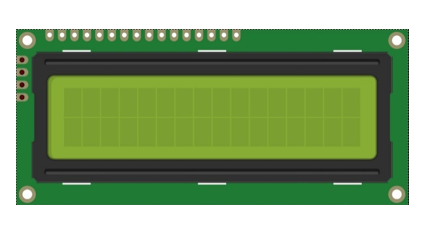

Component Knowledge
=================================

I2C LCD1602
-------------------------------

LCD1602 can display 2 lines of characters in 16 columns. It can display numbers, letters, symbols, ASCII code and so on.

I2C LCD1602 Display Screen integrates a I2C interface, which connects the serial-input & parallel-output module to the LCD1602 Display Screen. This allows us to only use 4 lines to the operate the LCD1602.

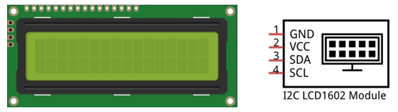

I2C (Inter-Integrated Circuit) is a two-wire serial communication, which is used to connect micro controller with its peripheral equipments. Device that use I2C communication are all connected to the serial data (SDA) line and a serial clock (SCL) line (called I2C bus). Each device among them has a unique address and can be a transmitter or receiver. Additionally, they can communicate with devices connected to the Bus.

Next, let's try to use the LCD1602 I2C module to display characters.

Circuit
===========================

The connection of control board and I2C LCD1602 is shown below.

.. list-table:: 
   :width: 100%
   :align: center

   * -  Schematic diagram
   * -  |Chapter20_04|
   * -  Hardware connection 
     
        If you need any support, please feel free to contact us via: support@freenove.com

   * -  |Chapter20_05|

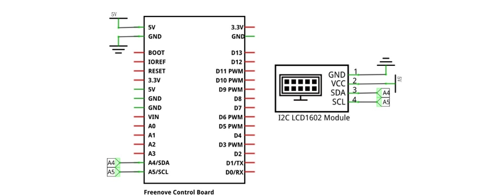
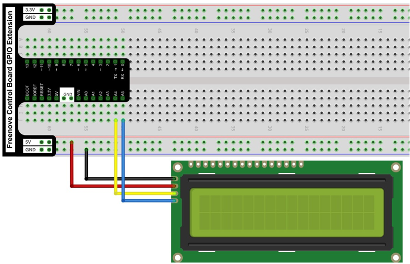

Sketch
===========================

Sketch Display_the_string_on_LCD1602
--------------------------

This code uses a library named "LiquidCrystal_I2C", if you have not installed it, please do so first.

Library is an important feature of the open source world, and we know that Arduino is an open source platform

that everyone can contribute to.

How to install the library
-------------------------------

There are two ways to add libraries.

you can search "LiquidCrystal_I2C" in library manager to install.

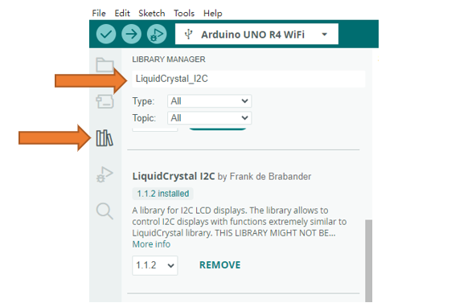

The second way, Click "Add .ZIP Library..." and then find LiquidCrystal_I2C.zip in libraries folder (this folder is in the folder unzipped form the ZIP file we provided). This library can facilitate our operation of I2C LCD1602.

Now let's start to write code to use LCD1602 to display static characters and dynamic variables.

.. literalinclude:: ../../../freenove_Kit/Sketches/Sketch_20.1.1_Display_the_string_on_LCD1602/Sketch_20.1.1_Display_the_string_on_LCD1602.ino
    :linenos: 
    :language: c
    :lines: 1-37
    :dedent:

Following are the LiquidCrystal_I2C library used for controlling LCD:

.. literalinclude:: ../../../freenove_Kit/Sketches/Sketch_20.1.1_Display_the_string_on_LCD1602/Sketch_20.1.1_Display_the_string_on_LCD1602.ino
    :linenos: 
    :language: c
    :lines: 8-8
    :dedent:

LiquidCrystal_I2C library provides LiquidCrystal_I2C class that controls LCD1602. When we instantiate a LiquidCrystal_I2C object, we can input some parameters. And these parameters are the row/column numbers of the I2C addresses and screen that connect to LCD1602:

.. code-block:: c

    LiquidCrystal_I2C lcd(0x27, 16, 2); // set the LCD address to 0x27 for a 16 chars and 2 line display

First, initialize the LCD and turn on LCD backlight.

.. literalinclude:: ../../../freenove_Kit/Sketches/Sketch_20.1.1_Display_the_string_on_LCD1602/Sketch_20.1.1_Display_the_string_on_LCD1602.ino
    :linenos: 
    :language: c
    :lines: 17-18
    :dedent:

And then print a string:

.. literalinclude:: ../../../freenove_Kit/Sketches/Sketch_20.1.1_Display_the_string_on_LCD1602/Sketch_20.1.1_Display_the_string_on_LCD1602.ino
    :linenos: 
    :language: c
    :lines: 19-19
    :dedent:

Print a changing number in the loop () function:

.. literalinclude:: ../../../freenove_Kit/Sketches/Sketch_20.1.1_Display_the_string_on_LCD1602/Sketch_20.1.1_Display_the_string_on_LCD1602.ino
    :linenos: 
    :language: c
    :lines: 22-28
    :dedent:

Before printing characters, we need to set the coordinate of the printed character, that is, in which line and which column:

.. literalinclude:: ../../../freenove_Kit/Sketches/Sketch_20.1.1_Display_the_string_on_LCD1602/Sketch_20.1.1_Display_the_string_on_LCD1602.ino
    :linenos: 
    :language: c
    :lines: 24-24
    :dedent:

.. py:function:: LiquidCrystal_I2C Class	

    LiquidCrystal_I2C class can control common LCD screen. First, we need instantiate an object of LiquidCrystal_I2C type, for example:

    **LiquidCrystal_I2C lcd(0x27, 16, 2);**

    When an object is instantiated, a constructed function of the class is called a constructor. In the constructor function, we need to fill in the I2C address of the LCD module, as well as the number of columns and rows of the LCD module. The number of columns and rows can also be set in the lcd.begin ().

    The functions used in the LiquidCrystal_I2C class are as follows:

    **lcd.setCursor (col, row):** set the coordinates of the to-be-printed character. The parameters are the numbers of columns and rows of the characters (start from 0, the number 0 represents first row or first line).

    **lcd.print (data):** print characters. Characters will be printed on the coordinates set before. If you do not set the coordinates, the string will be printed behind the last printed character.

Verify and upload the code, then observe the LCD screen. If the display is not clear or there is no display, adjust the potentiometer on the back of I2C module to adjust the screen contrast until the character is clearly displayed on the LCD.

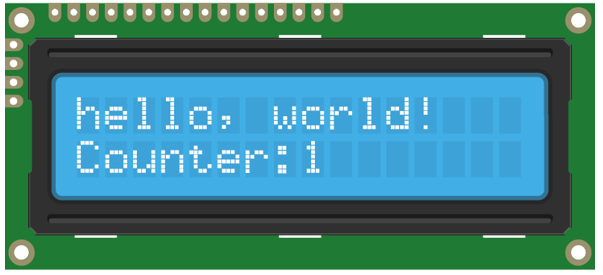

You can use the I2C LCD1602 to replace the serial port as a mobile screen when you print the data latter.

Project I2C LCD1602 Clock
******************************************

In the previous chapter, we have used I2C LCD1602 to display some strings, and now let us use I2C LCD1602 to display the temperature sensor value.

Component List
============================

+-----------------------------------------------------------------+
| Control board x1                                                |
|                                                                 |
| |Chapter01_00|                                                  |
+--------------------------+--------------------------------------+
| Breadboard x1            | GPIO Extension Board x1              |
|                          |                                      |
| |Chapter02_00|           | |Chapter02_01|                       |
+------------------+-------+--------------------------------------+
| USB cable x1     | Jumper M/M x3                                |
|                  |                                              |
| |Chapter01_02|   | |Chapter01_03|                               |
+------------------+----+----------------+------------------------+
| I2C LCD1602 Module x1 | Thermistor x1  | Resistor 10kΩ x1       |
|                       |                |                        |
| |Chapter20_02|        | |Chapter20_08| |  |Chapter20_09|        |
+-----------------------+----------------+------------------------+

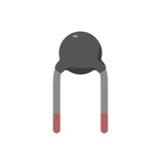
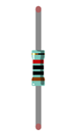

Code Knowledge
============================

Timer
---------------------------

A Timer can be set to produce an interrupt after a period of time. When a timer interrupt occurs, the processor will jump to the interrupt function to process the interrupt event. And after completion the processing, execution will return to the interrupted location to go on. If you don't close the timer, interrupt will occur at the intervals you set.

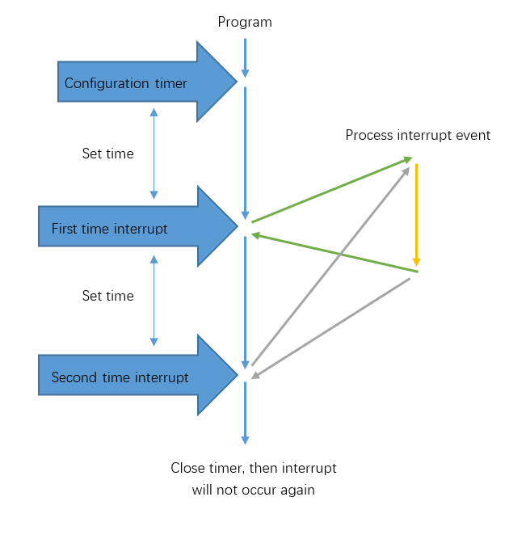

Circuit
===========================

The connection is shown below. Pin A0 is used to detect the voltage of thermistor.

.. list-table:: 
   :width: 100%
   :align: center

   * -  Schematic diagram
   * -  |Chapter20_11|
   * -  Hardware connection 
     
        If you need any support, please feel free to contact us via: support@freenove.com

   * -  |Chapter20_12|

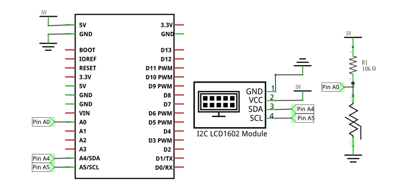
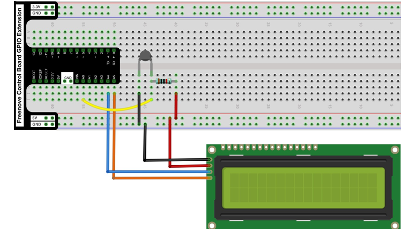

Sketch
==========================

This code uses a library named "CallbackTimerR4 ", if you have not installed it, please do so first.

Library is an important feature of the open source world, and we know that Arduino is an open source platform

that everyone can contribute to.

How to install the library
----------------------------------

open Arduino IDE, click Sketch -> Include Library -> Add .ZIP Library, In the pop-up window, find the file named "./Libraries/ CallbackTimerR4-main.zip" which locates in this directory, and click OPEN.

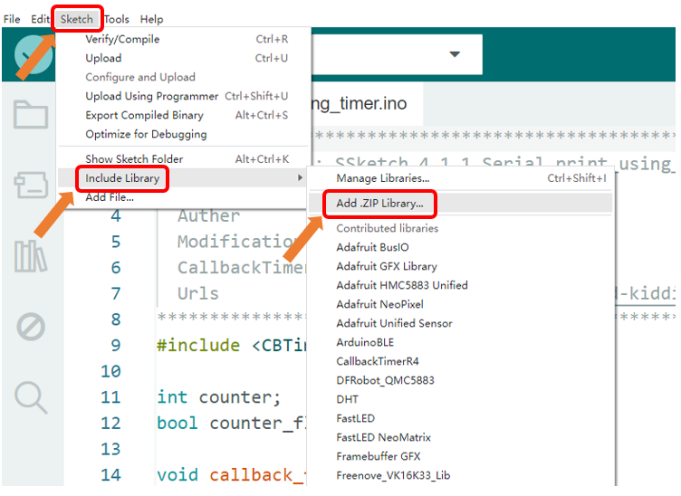

Sketch LCD1602_Clock
------------------------------

The CBTimer library is used here to manipulate timers.

Now write code to make LCD1602 display the time and temperature, and the time can be modified through the serial port.

.. literalinclude:: ../../../freenove_Kit/Sketches/Sketch_20.2.1_LCD1602_Clock/Sketch_20.2.1_LCD1602_Clock.ino
    :linenos: 
    :language: c
    :lines: 1-134
    :dedent:

In the code, we define 3 variables to represent time: second, minute, hour.

.. literalinclude:: ../../../freenove_Kit/Sketches/Sketch_20.2.1_LCD1602_Clock/Sketch_20.2.1_LCD1602_Clock.ino
    :linenos: 
    :language: c
    :lines: 28-29
    :dedent:

After every interrupt, the second plus 1.

.. literalinclude:: ../../../freenove_Kit/Sketches/Sketch_20.2.1_LCD1602_Clock/Sketch_20.2.1_LCD1602_Clock.ino
    :linenos: 
    :language: c
    :lines: 63-65
    :dedent:

In the loop () function, the information on the LCD display will be refreshed at set intervals.

.. code-block:: c

    void loop() {
        ...
        lcdDisplay();             // display temperature and time information on LCD
        delay(200);
        serial_Event();
    }

In the loop function, we need to control the second, minute, hour. When the second increases to 60, the minute adds 1, and the second is reset to zero; when the minute increases to 60, the hour adds 1, and the minute is reset to zero; when the hour increases to 24, reset it to zero.  

.. literalinclude:: ../../../freenove_Kit/Sketches/Sketch_20.2.1_LCD1602_Clock/Sketch_20.2.1_LCD1602_Clock.ino
    :linenos: 
    :language: c
    :lines: 35-45
    :dedent:

We define a function lcdDisplay () to refresh the information on LCD display. In this function, use two bit to display the hour, minute, second on the LCD. For example, hour/ 10 is the unit, hour% 10 is the tens.

.. literalinclude:: ../../../freenove_Kit/Sketches/Sketch_20.2.1_LCD1602_Clock/Sketch_20.2.1_LCD1602_Clock.ino
    :linenos: 
    :language: c
    :lines: 97-112
    :dedent:

The serial_Event function is used to receive the data sent by the computer to adjust the time and return the data for confirmation.

.. literalinclude:: ../../../freenove_Kit/Sketches/Sketch_20.2.1_LCD1602_Clock/Sketch_20.2.1_LCD1602_Clock.ino
    :linenos: 
    :language: c
    :lines: 67-95
    :dedent:

We also define a function that displays a scrolling string when the control board has been just started.

.. literalinclude:: ../../../freenove_Kit/Sketches/Sketch_20.2.1_LCD1602_Clock/Sketch_20.2.1_LCD1602_Clock.ino
    :linenos: 
    :language: c
    :lines: 51-61
    :dedent:

Verify and upload the code. The LCD screen will display a scrolling string first, and then displays the temperature and time. We can open Serial Monitor and enter time in the sending area, then click the Send button to set the time.

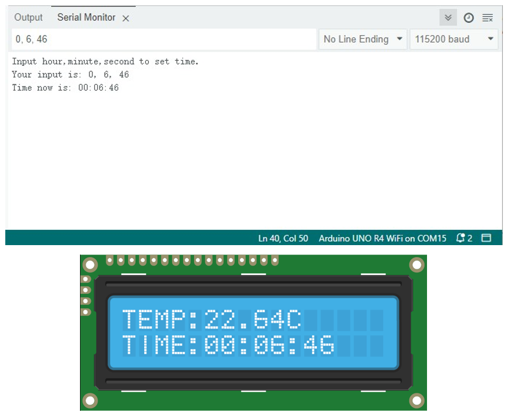