##############################################################################
Chapter Digital Display
##############################################################################

Digital display is a kind of device that can display one or several digits. We will learn how to use it in this chapter.

Project 1-digit 7-segment Display
***********************************************

Frist, try to use the digit display that can display 1-digit number.

Component List
============================

+-----------------------------------------------------------------+
| Control board x1                                                |
|                                                                 |
| |Chapter01_00|                                                  |
+--------------------------+--------------------------------------+
| Breadboard x1            | GPIO Extension Board x1              |
|                          |                                      |
| |Chapter02_00|           | |Chapter02_01|                       |
+------------------+-------+--------------------------------------+
| USB cable x1     | Jumper M/M x3                                |
|                  |                                              |
| |Chapter01_02|   | |Chapter01_03|                               |
+---------------+--+--------------------+-------------------------+
| 74HC595 x1    | 1-digit 7-segment     | Resistor 220Ω x8        |
|               |                       |                         |
|               | display x1            |                         |
|               |                       |                         |
| |Chapter21_00||  |Chapter21_02|       |  |Chapter21_01|         |
+---------------+-----------------------+-------------------------+

.. |Chapter01_00| image:: ../_static/imgs/1_LED_Blink/Chapter01_00.png
.. |Chapter01_02| image:: ../_static/imgs/1_LED_Blink/Chapter01_02.png
.. |Chapter01_03| image:: ../_static/imgs/1_LED_Blink/Chapter01_03.png
.. |Chapter02_00| image:: ../_static/imgs/2_Two_LEDs_Blink/Chapter02_00.png
.. |Chapter02_01| image:: ../_static/imgs/2_Two_LEDs_Blink/Chapter02_01.png
.. |Chapter21_00| image:: ../_static/imgs/21_Digital_Display/Chapter21_00.png
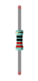
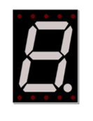

Component Knowledge
===========================

1-digit 7-segment display
----------------------------

A 7-Segment Display is a digital electronic display device. There is a figure "8" and a decimal point represented, which consists of 8 LEDs. It can display numbers of 0~9 by lighting some of its LED segment. The LEDs have a Common Anode and individual Cathodes. Its internal structure and pin designation diagram is shown below:

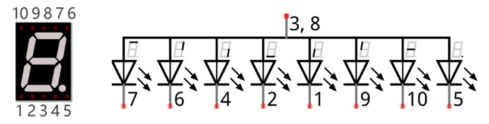

As we can see in the above circuit diagram, we can control the state of each LED separately. Also, by combining LEDs with different states of ON and OFF, we can display different characters (Numbers and Letters). For example, to display a "0": we need to turn ON LED segments 7, 6, 4, 2, 1 and 9, and turn OFF LED segments 5 and 10.

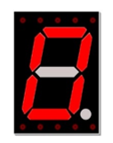

If we use a byte to show the state of the LEDs that connected to pin 5, 10, 9, 1, 2, 4, 6, 7, we can make 0 represent the state of ON and 1 for OFF. Then the number 0 can be expressed as a binary number 11000000, namely hex 0xc0.

The numbers and letters that can be display are shown below:

+---------------+---------------+--------------------+
| Number/Letter | Binary number | Hexadecimal number |
+---------------+---------------+--------------------+
| 0             | 11000000      | 0xc0               |
+---------------+---------------+--------------------+
| 1             | 11111001      | 0xf9               |
+---------------+---------------+--------------------+
| 2             | 10100100      | 0xa4               |
+---------------+---------------+--------------------+
| 3             | 10110000      | 0xb0               |
+---------------+---------------+--------------------+
| 4             | 10011001      | 0x99               |
+---------------+---------------+--------------------+
| 5             | 10010010      | 0x92               |
+---------------+---------------+--------------------+
| 6             | 10000010      | 0x82               |
+---------------+---------------+--------------------+
| 7             | 11111000      | 0xf8               |
+---------------+---------------+--------------------+
| 8             | 10000000      | 0x80               |
+---------------+---------------+--------------------+
| 9             | 10010000      | 0x90               |
+---------------+---------------+--------------------+
| A             | 10001000      | 0x88               |
+---------------+---------------+--------------------+
| b             | 10000011      | 0x83               |
+---------------+---------------+--------------------+
| C             | 11000110      | 0xc6               |
+---------------+---------------+--------------------+
| d             | 10100001      | 0xa1               |
+---------------+---------------+--------------------+
| E             | 10000110      | 0x86               |
+---------------+---------------+--------------------+
| F             | 10001110      | 0x8e               |
+---------------+---------------+--------------------+

Circuit
===========================

Use pin 11, 12, 13 on control board to control the 74HC595, and connect it to a1-digit 7-segment display.

.. list-table:: 
   :width: 100%
   :align: center

   * -  Schematic diagram
   * -  |Chapter21_05|
   * -  Hardware connection 
     
        If you need any support, please feel free to contact us via: support@freenove.com

   * -  |Chapter21_06|

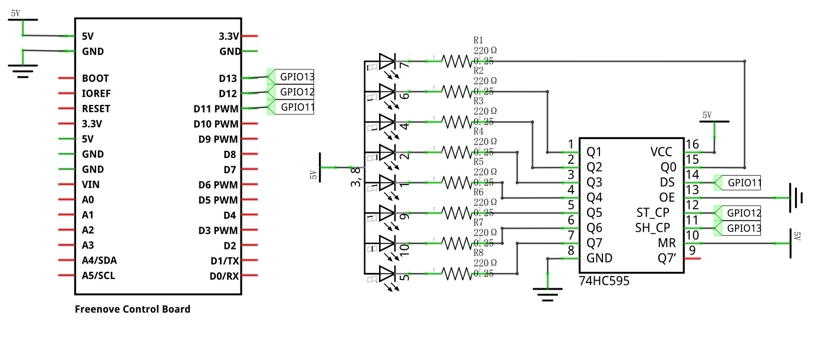
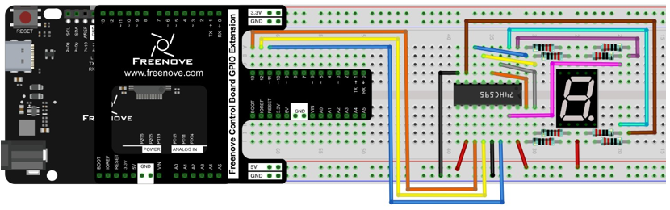

Sketch
=============================

Sketch 1_Digit_7_Segment_Display
-----------------------------

Now write code to control the 1-digit 7-segment display through 74HC595.

.. literalinclude:: ../../../freenove_Kit/Sketches/Sketch_21.1.1_1_Digit_7_Segment_Display/Sketch_21.1.1_1_Digit_7_Segment_Display.ino
    :linenos: 
    :language: c
    :lines: 1-33
    :dedent:

We define an array to save and display the encoding of character 0-F in this code.

.. literalinclude:: ../../../freenove_Kit/Sketches/Sketch_21.1.1_1_Digit_7_Segment_Display/Sketch_21.1.1_1_Digit_7_Segment_Display.ino
    :linenos: 
    :language: c
    :lines: 13-13
    :dedent:

Initialize the pin connected to 74HC595 in setup() function.

.. literalinclude:: ../../../freenove_Kit/Sketches/Sketch_21.1.1_1_Digit_7_Segment_Display/Sketch_21.1.1_1_Digit_7_Segment_Display.ino
    :linenos: 
    :language: c
    :lines: 15-20
    :dedent:

Then in loop() function, send the encoding of 0-F to 74HC595 circularly.

.. literalinclude:: ../../../freenove_Kit/Sketches/Sketch_21.1.1_1_Digit_7_Segment_Display/Sketch_21.1.1_1_Digit_7_Segment_Display.ino
    :linenos: 
    :language: c
    :lines: 24-32
    :dedent:

Verify and upload the code, then you will see the 1-digit 7-segment display show 0-F in a circular manner.

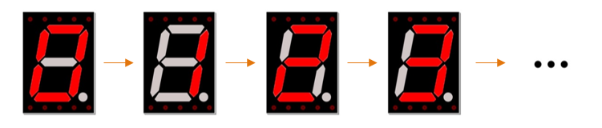

Project 4-digit 7-segment Display
***********************************************

Now, try to use digit display that can display 4-digit numbers.

Component List
=====================================

+-----------------------------------------------------------------+
| Control board x1                                                |
|                                                                 |
| |Chapter01_00|                                                  |
+--------------------------+--------------------------------------+
| Breadboard x1            | GPIO Extension Board x1              |
|                          |                                      |
| |Chapter02_00|           | |Chapter02_01|                       |
+------------------+-------+--------------------------------------+
| USB cable x1     | Jumper M/M x3                                |
|                  |                                              |
| |Chapter01_02|   | |Chapter01_03|                               |
+---------------+--+--------------------+-------------------------+
| 74HC595 x1    | 4-digit 7-segment     | Resistor 220Ω x8        |
|               |                       |                         |
|               | display x1            |                         |
|               |                       |                         |
| |Chapter21_00||  |Chapter21_08|       |  |Chapter21_01|         |
+---------------+-----------------------+-------------------------+

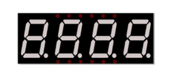

Component Knowledge
====================================

4-digit 7-segment display
---------------------------------

A 4 Digit 7-segment display integrates four 7-Segment Displays into one module, therefore it can display more characters. All of the LEDs contained have a Common Anode and individual Cathodes. Its internal structure and pin designation diagram is shown below:

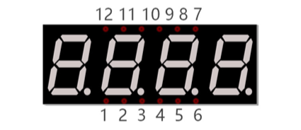

The internal electronic circuit is shown below, and all eight LED cathode pins of each 1-digit 7-segment display are connected together.

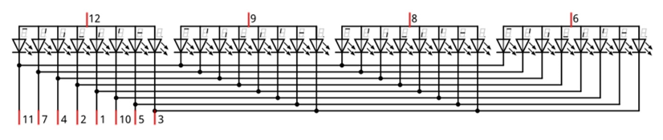

Display method of 4 Digit 7-segment display is similar to 1 Digit 7-segment display. The difference between them is that the 4-Digit displays each Digit is visible in turn, one by one and not together. We need to first send high level to the common end of the first Digit Display, and send low level to the remaining three common ends, and then send content to 8 LED cathode pins of the first Digit Display. At this time, the first 7-Segment Display will show visible content and the remaining three will be OFF.

Similarly, the second, third and fourth 7-Segment Displays will show visible content in turn by scanning the display. Although the four number characters are displayed in turn separately, this process is so fast that it is unperceivable to the naked eye. This is due to the principle of optical afterglow effect and the vision persistence effect in human sight. This is how we can see all 4 number characters at the same time. However, if each number character is displayed for a longer period, you will be able to see that the number characters are displayed separately. 

Circuit
==========================

Use pin 11, 12, 13 on control board to control the 74HC595, and connect it to the 4-digit 7-segment display. Use pin 7, 6, 5, 4 to control the 4 common ports.

.. list-table:: 
   :width: 100%
   :align: center

   * -  Schematic diagram
   * -  |Chapter21_11|
   * -  Hardware connection 
     
        If you need any support, please feel free to contact us via: support@freenove.com

   * -  |Chapter21_12|

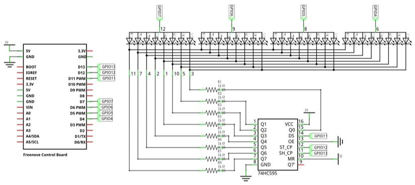
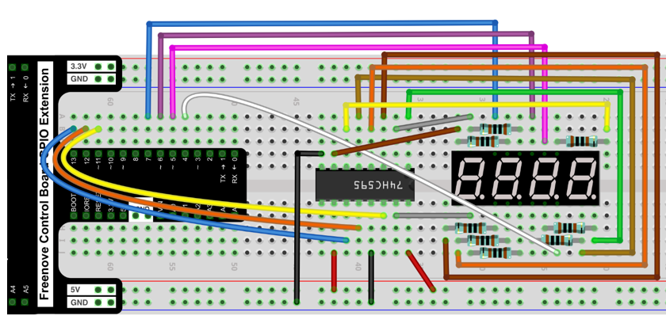

Sketch
===============================

This code uses a library named "CallbackTimerR4 ", if you have not installed it, please do so first.

Library is an important feature of the open source world, and we know that Arduino is an open source platform

that everyone can contribute to.

How to install the library
----------------------------------

open Arduino IDE, click Sketch -> Include Library -> Add .ZIP Library, In the pop-up window, find the file named "./Libraries/ CallbackTimerR4-main.zip" which locates in this directory, and click OPEN.

Sketch 4_Digit_7-Segment_Display
--------------------------------

Now, write code to control 4-digit 7-segment display to display 4 numbers.

.. literalinclude:: ../../../freenove_Kit/Sketches/Sketch_21.2.1_4_Digit_7-Segment_Display/Sketch_21.2.1_4_Digit_7-Segment_Display.ino
    :linenos: 
    :language: c
    :lines: 1-54
    :dedent:

Besides the similarity with the previous section, the difference is that this code is to output content to the four 7-segment display continuously. Write a function to select a common port.

.. literalinclude:: ../../../freenove_Kit/Sketches/Sketch_21.2.1_4_Digit_7-Segment_Display/Sketch_21.2.1_4_Digit_7-Segment_Display.ino
    :linenos: 
    :language: c
    :lines: 38-45
    :dedent:

Write a function to send data to 74HC595.

.. literalinclude:: ../../../freenove_Kit/Sketches/Sketch_21.2.1_4_Digit_7-Segment_Display/Sketch_21.2.1_4_Digit_7-Segment_Display.ino
    :linenos: 
    :language: c
    :lines: 47-54
    :dedent:

First select a common port and then output the content, which will be displayed by the 7-segment display connected to common port, to 74HC595 when operating. Clear the display content after a period of time to avoid ghosting phenomenon.

.. literalinclude:: ../../../freenove_Kit/Sketches/Sketch_21.2.1_4_Digit_7-Segment_Display/Sketch_21.2.1_4_Digit_7-Segment_Display.ino
    :linenos: 
    :language: c
    :lines: 28-34
    :dedent:

Use cycle command in loop() function to output content to the four 7-segment display.

.. code-block:: c

    for (int i = 0; i < 4; i++) {
        ...
    }

Repeat this operation continuously.

Verify and upload the code, and then you will see number 0123 shown by 4 digit 7-segment display.

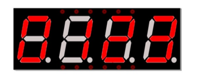

Sketch 4_Digit_7-Segment_Display
--------------------------

Now write code to control 4-digit 7-segment display to display dynamic numbers.

.. literalinclude:: ../../../freenove_Kit/Sketches/Sketch_21.2.2_4_Digit_7-Segment_Display/Sketch_21.2.2_4_Digit_7-Segment_Display.ino
    :linenos: 
    :language: c
    :lines: 1-75
    :dedent:

Frist set a timer with a cycle of 1s

.. literalinclude:: ../../../freenove_Kit/Sketches/Sketch_21.2.2_4_Digit_7-Segment_Display/Sketch_21.2.2_4_Digit_7-Segment_Display.ino
    :linenos: 
    :language: c
    :lines: 32-33
    :dedent:

In the timer interrupt function, make the variable second plus 1

.. literalinclude:: ../../../freenove_Kit/Sketches/Sketch_21.2.2_4_Digit_7-Segment_Display/Sketch_21.2.2_4_Digit_7-Segment_Display.ino
    :linenos: 
    :language: c
    :lines: 55-57
    :dedent:

In function loop(), The first Digit is used for displaying single digits of "dec", the second Digit is for tens, the third for hundreds and fourth for thousands respectively.

.. literalinclude:: ../../../freenove_Kit/Sketches/Sketch_21.2.2_4_Digit_7-Segment_Display/Sketch_21.2.2_4_Digit_7-Segment_Display.ino
    :linenos: 
    :language: c
    :lines: 38-42
    :dedent:

Then display the value of each bit.

.. literalinclude:: ../../../freenove_Kit/Sketches/Sketch_21.2.2_4_Digit_7-Segment_Display/Sketch_21.2.2_4_Digit_7-Segment_Display.ino
    :linenos: 
    :language: c
    :lines: 48-48
    :dedent:

Verify and upload the code, then you will see the dymaic number shown by 4 digit 7-segment display.